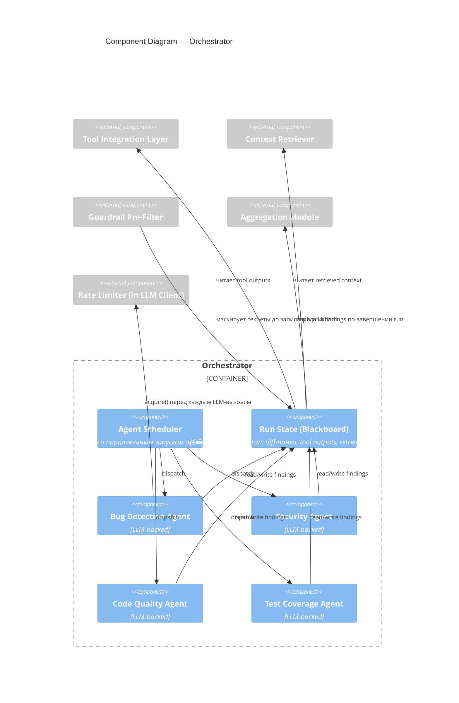

# C4 — Component Diagram (Orchestrator)

Внутреннее устройство Orchestrator — ядра системы. Правила переходов и stop condition — [specs/agent-orchestrator.md](../specs/agent-orchestrator.md).

**Stop condition:** Aggregation запускается, когда все агенты завершены либо истёк run-level timeout — не блокируется одним зависшим агентом (см. [specs/agent-orchestrator.md](../specs/agent-orchestrator.md)).

**Rate limiting — где на самом деле реализовано.** Более ранняя версия этой диаграммы рисовала единый "Circuit Breaker / Rate Limiter" как часть Orchestrator, проверяющий лимиты перед любым внешним вызовом. По факту throttling реализован отдельно для каждого внешнего клиента, а не единым компонентом оркестратора:
- **LLM API** — `RateLimiter` (sliding-window, `src/pr_review_agent/rate_limiter.py`), подключён внутри `LLMClient.complete()` (`src/pr_review_agent/llm_client.py`). Добавлен по итогам реального инцидента — Gemini free tier вернул `429 RESOURCE_EXHAUSTED` под параллельной нагрузкой 4 агентов (`eval/README.md`, "Operational finding"); дефолт 5 запросов/мин подобран под наблюдаемый лимит.
- **GitHub API** — retry с exponential backoff внутри `GitHubClient` (`src/pr_review_agent/github_client.py`), не rate limiter в строгом смысле (нет client-side throttling до превышения лимита GitHub, только реакция на 5xx/429 после факта).

Ни то, ни другое не является полноценным circuit breaker (нет состояния open/half-open/closed с автоматическим восстановлением) — это осознанное упрощение для PoC-масштаба, отражённое здесь, а не молчаливое расхождение с кодом.
