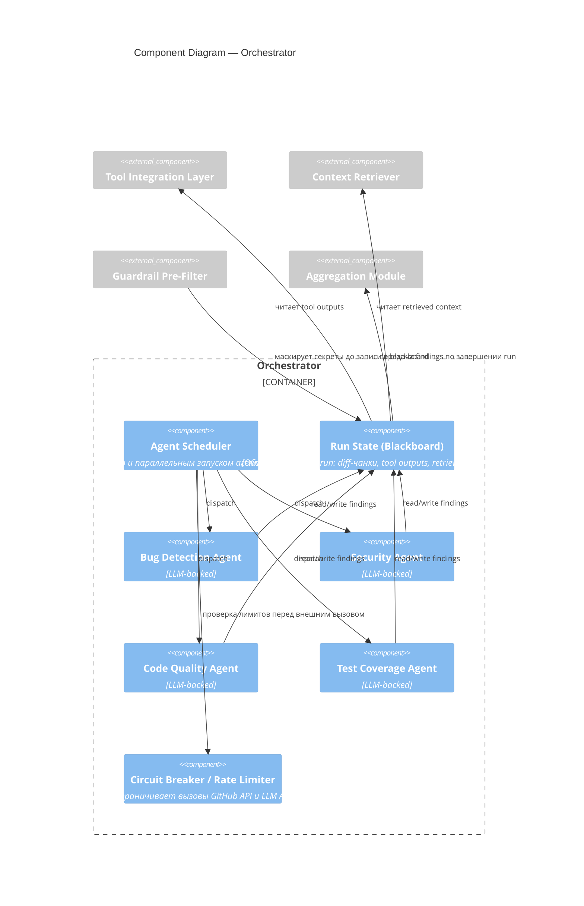

# C4 — Component Diagram (Orchestrator)

Внутреннее устройство Orchestrator — ядра системы. Правила переходов и stop condition — [specs/agent-orchestrator.md](../specs/agent-orchestrator.md).

**Stop condition:** Aggregation запускается, когда все агенты завершены либо истёк run-level timeout — не блокируется одним зависшим агентом (см. [specs/agent-orchestrator.md](../specs/agent-orchestrator.md)).
