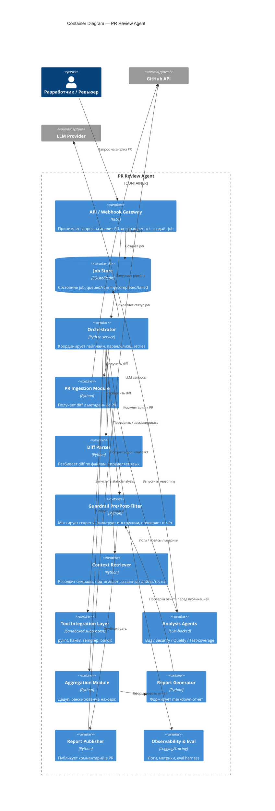

# C4 — Container Diagram

Внутренние контейнеры системы PR Review Agent. Роли модулей — [system-design.md](../system-design.md#2-модули-и-их-роли).

```mermaid
C4Container
  title Container Diagram — PR Review Agent

  Person(dev, "Разработчик / Ревьюер")
  System_Ext(github, "GitHub API")
  System_Ext(llm, "LLM Provider")

  Container_Boundary(system, "PR Review Agent") {
    Container(gateway, "API / Webhook Gateway", "REST", "Принимает запрос на анализ PR, возвращает ack, создаёт job")
    ContainerDb(jobstore, "Job Store", "SQLite/Redis", "Состояние job: queued/running/completed/failed")
    Container(orchestrator, "Orchestrator", "Python service", "Координирует пайплайн, параллелизм, retries")
    Container(ingestion, "PR Ingestion Module", "Python", "Получает diff и метаданные PR")
    Container(parser, "Diff Parser", "Python", "Разбивает diff по файлам, определяет язык")
    Container(guardrail, "Guardrail Pre/Post-Filter", "Python", "Маскирует секреты, фильтрует инструкции, проверяет отчёт")
    Container(retriever, "Context Retriever", "Python", "Резолвит символы, подтягивает связанные файлы/тесты")
    Container(tools, "Tool Integration Layer", "Sandboxed subprocess", "pylint, flake8, semgrep, bandit")
    Container(agents, "Analysis Agents", "LLM-backed", "Bug / Security / Quality / Test-coverage")
    Container(aggregator, "Aggregation Module", "Python", "Дедуп, ранжирование находок")
    Container(reportgen, "Report Generator", "Python", "Формирует markdown-отчёт")
    Container(publisher, "Report Publisher", "Python", "Публикует комментарий в PR")
    Container(observability, "Observability & Eval", "Logging/Tracing", "Логи, метрики, eval harness")
  }

  Rel(dev, gateway, "Запрос на анализ PR")
  Rel(gateway, jobstore, "Создаёт job")
  Rel(gateway, orchestrator, "Запускает pipeline")
  Rel(orchestrator, ingestion, "Получить diff")
  Rel(ingestion, github, "GitHub API")
  Rel(orchestrator, parser, "Распарсить diff")
  Rel(orchestrator, guardrail, "Проверить / замаскировать")
  Rel(orchestrator, retriever, "Получить доп. контекст")
  Rel(orchestrator, tools, "Запустить static analysis")
  Rel(orchestrator, agents, "Запустить reasoning")
  Rel(agents, llm, "LLM запросы")
  Rel(orchestrator, aggregator, "Собрать находки")
  Rel(aggregator, reportgen, "Сформировать отчёт")
  Rel(reportgen, guardrail, "Проверка отчёта перед публикацией")
  Rel(guardrail, publisher, "Опубликовать")
  Rel(publisher, github, "Комментарий к PR")
  Rel(orchestrator, jobstore, "Обновляет статус job")
  Rel(orchestrator, observability, "Логи / трейсы / метрики")
```
