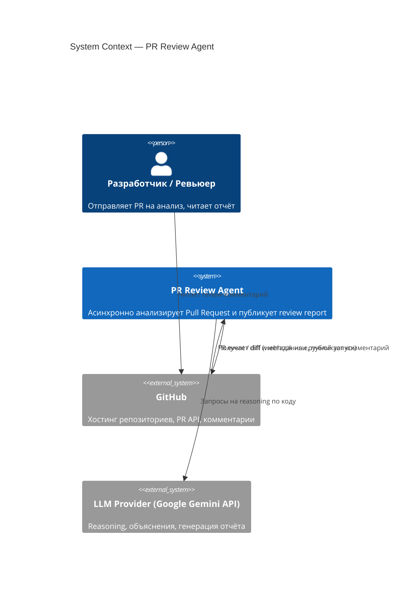

# C4 — Context Diagram

Система, пользователь и внешние сервисы. Подробности архитектурных решений — [system-design.md](../system-design.md).

**Границы системы:** PR Review Agent не имеет прав на изменение кода, мердж или CI/CD — только чтение diff и публикация комментария (см. [governance.md](../governance.md), раздел 5).
