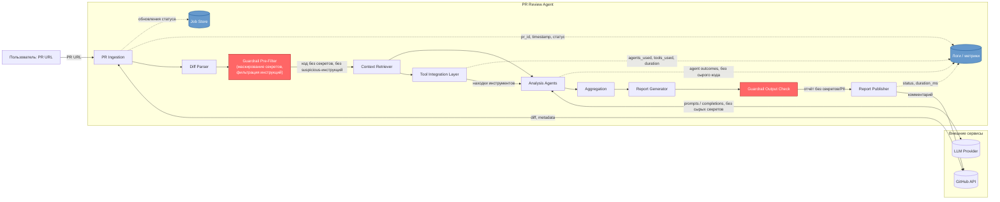

# Data Flow Diagram — что хранится, что логируется, что маскируется

**Не сохраняется и не логируется** (см. [governance.md](../governance.md), раздел 2–3): полный код PR, секреты/токены/API-ключи, сырой LLM prompt целиком. В Job Store и логах хранятся только метаданные run и агрегированные результаты анализа, ограниченное время (например 30 дней).

**Точки маскирования/проверки** выделены на диаграмме: Guardrail Pre-Filter (до LLM) и Guardrail Output Check (до публикации) — единственные места, где данные покидают систему в сторону LLM Provider или GitHub.
