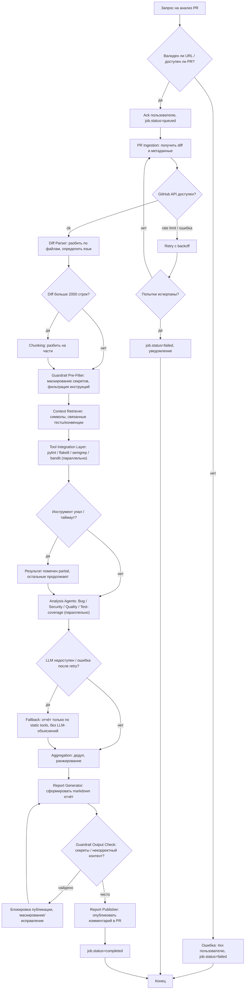

# Workflow Diagram — пошаговое выполнение с ветками ошибок

```mermaid
flowchart TD
  A[Запрос на анализ PR] --> B{Валиден ли URL / доступен ли PR?}
  B -- нет --> B1[Ошибка: 4xx пользователю, job.status=failed]
  B -- да --> C[Ack пользователю, job.status=queued]
  C --> D[PR Ingestion: получить diff и метаданные]
  D --> E{GitHub API доступен?}
  E -- rate limit / ошибка --> E1[Retry с backoff]
  E1 --> E2{Попытки исчерпаны?}
  E2 -- да --> R2[job.status=failed, уведомление]
  E2 -- нет --> D
  E -- ok --> F[Diff Parser: разбить по файлам, определить язык]
  F --> G{Diff больше 2000 строк?}
  G -- да --> G1[Chunking: разбить на части]
  G -- нет --> H[Guardrail Pre-Filter: маскирование секретов, фильтрация инструкций]
  G1 --> H
  H --> I[Context Retriever: символы, связанные тесты/конвенции]
  I --> J["Tool Integration Layer: pylint / flake8 / semgrep / bandit (параллельно)"]
  J --> K{Инструмент упал / таймаут?}
  K -- да --> K1[Результат помечен partial, остальные продолжают]
  K -- нет --> L["Analysis Agents: Bug / Security / Quality / Test-coverage (параллельно)"]
  K1 --> L
  L --> M{LLM недоступен / ошибка после retry?}
  M -- да --> M1[Fallback: отчёт только по static tools, без LLM-объяснений]
  M -- нет --> N[Aggregation: дедуп, ранжирование]
  M1 --> N
  N --> O[Report Generator: сформировать markdown отчёт]
  O --> P{Guardrail Output Check: секреты / некорректный контент?}
  P -- найдено --> P1[Блокировка публикации, маскирование/исправление]
  P1 --> O
  P -- чисто --> Q[Report Publisher: опубликовать комментарий в PR]
  Q --> R[job.status=completed]
  B1 --> Z[Конец]
  R2 --> Z
  R --> Z
```

Соответствие шагов модулям — [system-design.md, раздел 3](../system-design.md#3-основной-workflow-выполнения-задачи).
